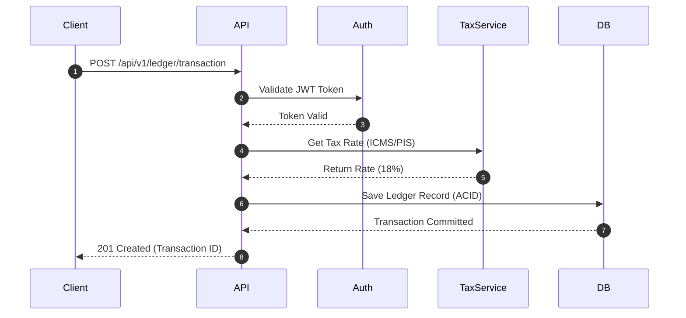

```mermaid
sequenceDiagram
    autonumber
    Client->>API: POST /api/v1/ledger/transaction
    API->>Auth: Validate JWT Token
    Auth-->>API: Token Valid
    API->>TaxService: Get Tax Rate (ICMS/PIS)
    TaxService-->>API: Return Rate (18%)
    API->>DB: Save Ledger Record (ACID)
    DB-->>API: Transaction Committed
    API-->>Client: 201 Created (Transaction ID)
```